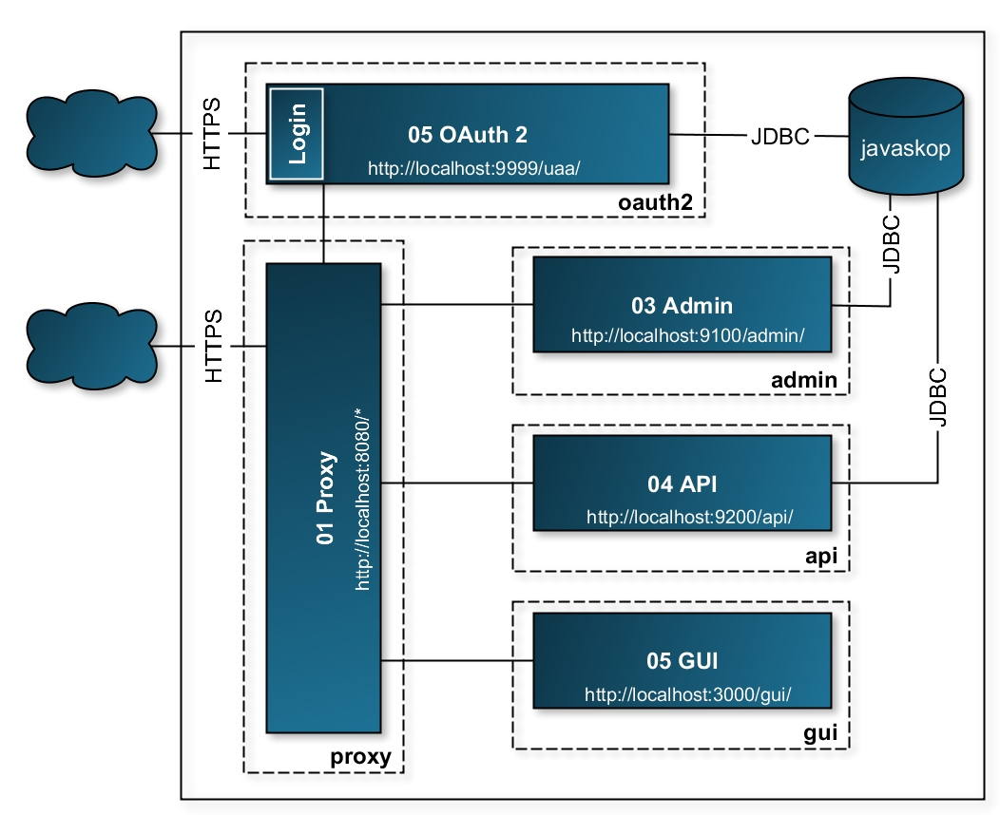
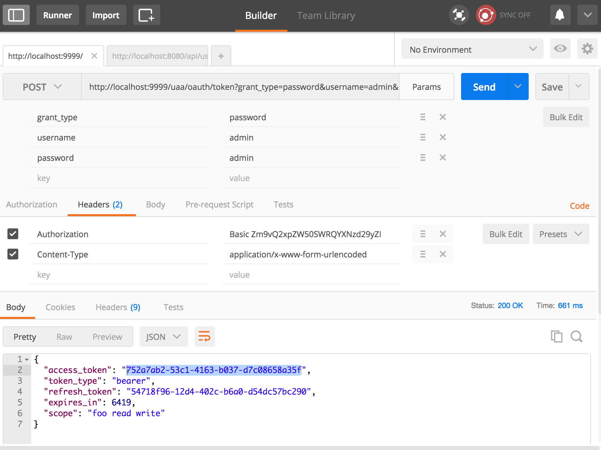
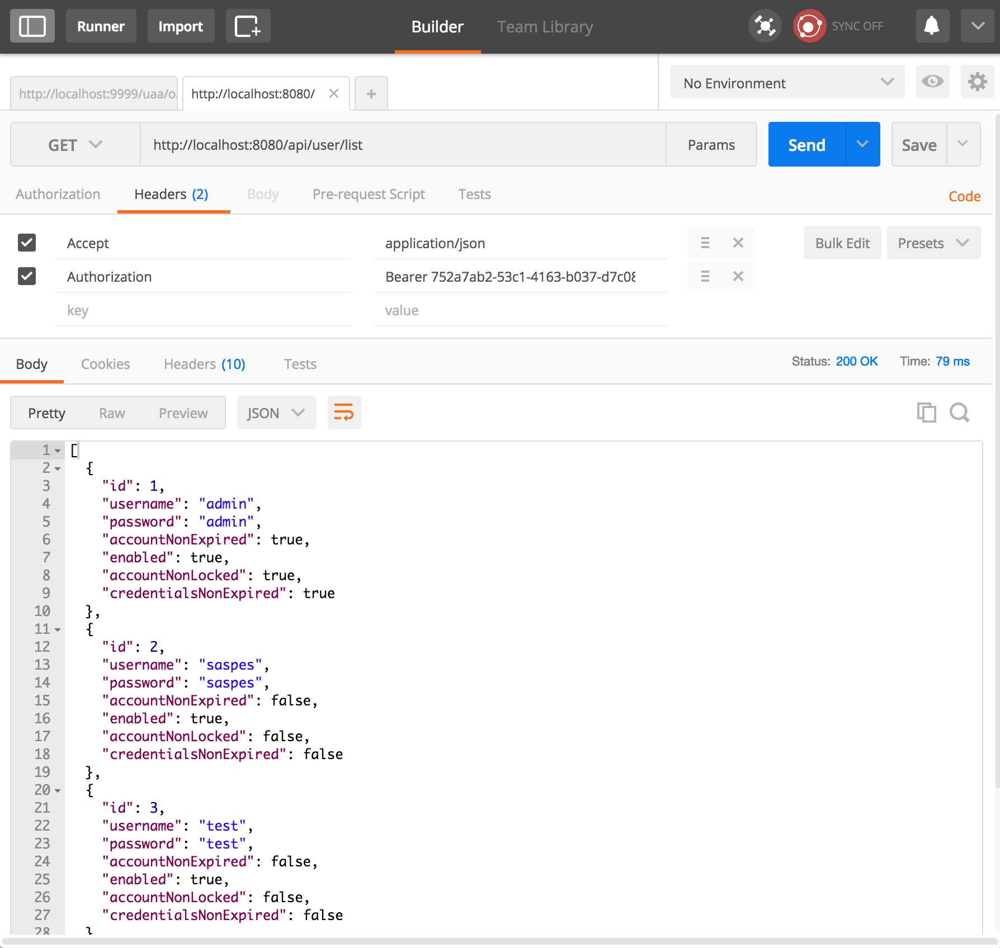

# [JavaSkop 2017](http://jug.mk/javaskop17)

Spring Boot SSO implemented with Oauth2 and Zuul proxy, focuses on client developer simplicity while providing specific authorization flows for web and desktop apps, mobile and IoT devices.

> Many thanks to [Polar Cape](http://polarcape.com/about-us/#team) colleagues for all the help and support in getting this project up and running

## Spring Boot SSO in 15 min

\#SpringBoot #Oauth2 #Zuul #MySQL #react #node #Thymeleaf

### Projects
* 01 Proxy
* 02 OAuth2
* 03 Admin
* 04 API
* 05 GUI

### Description
Spring Boot SSO implemented with Oauth2 and Zuul proxy, with .jdbc() instead of .inMemory(), focuses on client developer simplicity while providing specific authorization flows for web and desktop apps, mobile and IoT devices. Implementation .inMemory() will be faster, but if multiple clients are consuming this then it is better to have it in .jdbc(). Will use an OAuth2 server as the authenticator, so that we can also use it to grant tokens for the backend resource server using MySQL as client, user and token store. The goal is to work around CORS and the Same Origin Policy restriction of the browser and allow the UI to call the API even though they don't share the same origin using Zuul proxy.

### Architecture overview

### 05 GUI
`npm install`  
`npm run build`  
`npm run start`  

### Postman/RESTClient

Base64 encode for "Authorization"  
Mac/Linux `echo -n 'clientId:clientSecret' | openssl base64`

| Access and refresh token | Call API with access token   |
| :---: | :---: |
|  |  |

### Links
1. http://www.baeldung.com/spring-rest-with-zuul-proxy
    * zuul, cors
2. https://spring.io/guides/tutorials/spring-boot-oauth2/
    * official
3. https://github.com/Netflix/zuul
    * official
4. http://techblog.netflix.com/2013/06/announcing-zuul-edge-service-in-cloud.html
    * Announcing Zuul: Edge Service in the Cloud
5. http://techblog.netflix.com/2016/09/zuul-2-netflix-journey-to-asynchronous.html
    * Zuul 2 : The Netflix Journey to Asynchronous, Non-Blocking Systems
6. https://blog.heroku.com/using_netflix_zuul_to_proxy_your_microservices
    * Using Netflix Zuul to Proxy your Microservices
7. https://github.com/spring-guides/tut-spring-security-and-angular-js/issues/121
    * logout
8. https://docs.spring.io/spring-security/site/docs/current/reference/html/csrf.html#csrf-logout
    * logout
9. https://github.com/spring-guides/tut-spring-security-and-angular-js/issues/106
    * logout
10. http://stackoverflow.com/questions/38311521/issues-creating-oauth-secured-microservices-using-spring-boot-eureka-zuul-spr
    * behind proxy (Zuul)
11. http://cloud.spring.io/spring-cloud-netflix/spring-cloud-netflix.html#_cookies_and_sensitive_headers
    * Cookies and Sensitive Headers 
12. https://github.com/kakawait/uaa-behind-zuul-sample
    * oauth2 behind zuul
13. http://projects.spring.io/spring-cloud/spring-cloud.html#_token_relay
    * Token Relay
14. http://stackoverflow.com/questions/30327269/spring-oauth-authorization-server-behind-spring-cloud-zuul-proxy
    * https://<zuul hostname>/uaa/oauth/token
15. http://stackoverflow.com/questions/12909332/how-to-logout-of-an-application-where-i-used-oauth2-to-login-with-google
    * oauth2 explanation
16. http://stackoverflow.com/questions/33167609/why-does-loginlogout-redirect-to-login
    * login?logout explenation
17. http://stackoverflow.com/questions/34718586/spring-security-oauth2-enableoauth2sso-but-accept-tokens-as-authentication-t
    * Spring Security OAuth2 - @EnableOauth2Sso but accept tokens as authentication, too
